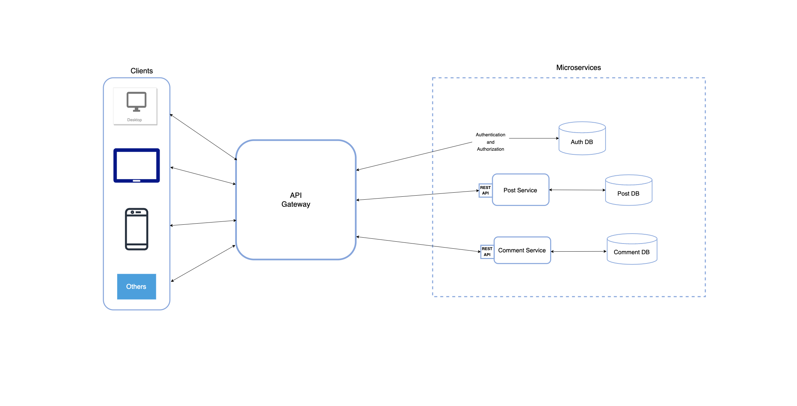

# Sample of a microservice based application architecture

### Overview of the application
If you want to ship a new software quickly and you don't have much resources in terms of finance and engineers, monolithic architecture is the way to go.

Think of Monolithic architecture as "everything together as one". It is a traditional way of building softwares from scratch as a single unit. It has a number of pros like ease of development and deployment, non-complex testing,  and is applicable in a small and medium codebase.

However, there comes a time when the codebase grows bigger and updates to a part of the codebase leads to a break in other parts because the application is tightly coupled together.

This is the problem that microservice architectural style solves.

Microservice architecture is a software architectural style that structure applications as a collection of loosely connected services, making it easier to build and scale applications.

In this repo, I built a sample of a microservice based application architecture with Laravel Lumen framework which can be cloned and used for your project.

It consists of two services, namely: PostService and CommentService and a API gateway.

The API Gateway is responsible for user authentication and it also routes requests to the appropriate microservice which in turn returns the appropriate response.

A direct access to any of the services is restricted through the middleware `ApiToken`.

The API Gateway uses an Oauth2 token based authentication for the microservices built with Laravel Passport.

### Architecture of the application

Attached below is a pictorial architecture of the application:

## Proposed Architecture



### General installation guides

#### Step 1: Clone the repository

```shell
git clone https://github.com/ayodeleoniosun/lumen-microservice.git
```

#### Step 2: Switch to the repo folder

```shell
cd lumen-microservice
```

#### Step 3: Setup app

```shell
bash setup.sh
```

#### Step 4: Update oauth credentials

Two credentials would be generated after the setup is completed, one for `personal access client` and the other for `password grant client`.

Copy the Client ID and the secret of the latter and update the `OAUTH_CLIENT_ID` and `OAUTH_CLIENT_SECRET` in the `env` of `apigateway`.

#### Step 5: Testing
Run the following command to run tests:

```shell
bash run-tests.sh
```

### API Documentation

The Postman API collection is available [Here](postman_collection.json). <br/>